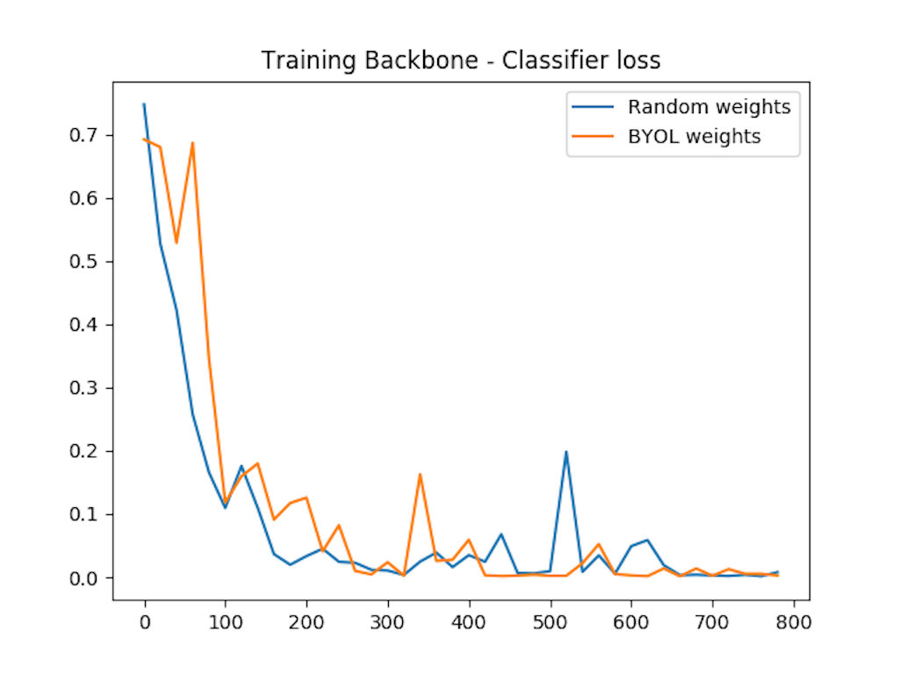
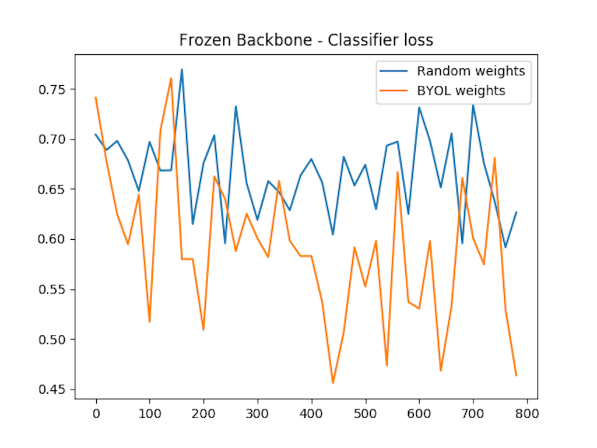

## Bootstrap Your Own Latent (BYOL) - PyTorch

This repository shows a simple implementation of [BYOL (Bootstrap Your Own Latent)](https://arxiv.org/abs/2006.07733) technique to perform self-supervised learning.

To show the functionality I used the [Cats and Dogs dataset](https://www.microsoft.com/en-us/download/confirmation.aspx?id=54765) which is full labeled, but to simulate a scenario where we would apply self-supervised learning, I took 250 images as labeled and all other samples (24750 samples) unlabeled. 

To fit in a 8GB GPU and run in a feasible time I used the following:
- Resnet18 (starting from random weights, not the pretrained) 
- Resize to (150x150)
- Batch size of 256. 
This configuration take ~ 80 sec per epoch.

## Pipeline
1. Train the self-supervised model using the code [train_byol.py](). At end it will be generated a saved named byol.pt

2. Train a [simple classifier]() using the same Resnet18 (starting from random weights, not the pretrained), add a classifier head at top of Resnet18, and use the 250 labeled data. 

3. Train a simple classifier using the encoder of the model byol.pt, add a classifier head at top of model, and use the 250 labeled data.

4. Plot the loss results

## Results
The first plot shows the training result training the full model (backbone + classification head). It clearly overfit but the goal here is to compare how quickly and stable is the training.

This second plot show the training loss of the froze backbone and training only the classification head. Here we can saw clearly that the backbone features from "Random weights" model performs worse compared with the features generate by the “BYOL weights” trained in self-supervised.

## References
- [Original paper: BYOL (Bootstrap Your Own Latent)](https://arxiv.org/abs/2006.07733)
- [Pytorch ligthning bolts](https://github.com/PyTorchLightning/pytorch-lightning-bolts)
- [lucidrains repository](https://github.com/lucidrains/byol-pytorch)